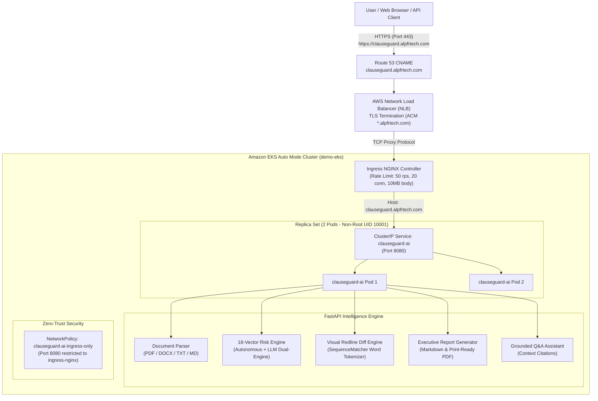

# ClauseGuard AI — Intelligent Contract Risk Auditing & Legal Intelligence SaaS

[](https://clauseguard.alpfrtech.com)
[](https://www.python.org/)
[](https://fastapi.tiangolo.com/)
[](https://aws.amazon.com/eks/)
[](https://www.docker.com/)
[](https://docs.pytest.org/)
[](https://opensource.org/licenses/MIT)

**ClauseGuard AI** is an enterprise-grade B2B and prosumer contract intelligence SaaS application. It empowers founders, business owners, consultants, freelancers, procurement teams, and legal counsels to instantly audit agreements, detect hidden legal risks across 18 specialized vectors, compute a standardized 0–100 risk score, inspect word-level visual redline diffs, and generate executive audit reports in **PDF** and **Markdown** with 1 click.

- **Live Production URL**: [https://clauseguard.alpfrtech.com](https://clauseguard.alpfrtech.com)
- **Health Check Endpoint**: [https://clauseguard.alpfrtech.com/healthz](https://clauseguard.alpfrtech.com/healthz)

---

## Architecture Overview



---

## Key Features

### 1. 🔍 Classified Red-Flag Audit (18 Legal Risk Vectors)
Audits contract text across 18 specialized legal risk vectors, including:
- **Indemnification**: Uncapped, one-sided indemnity without gross negligence/willful misconduct boundaries.
- **Limitation of Liability**: Nominal $100 caps, waiver of direct damages, or asymmetric exclusions.
- **Intellectual Property**: Broad assignment of pre-existing background IP, moral rights, and personal inventions.
- **Termination & Remedies**: Unilateral termination for convenience, absence of cure periods, and liquidated damages.
- **Restrictive Covenants**: Multi-year worldwide non-competes, aggressive customer non-solicitation, and perpetual NDAs.
- **Payment & Invoicing**: Unreasonable Net-90/120 payment terms, conditional "pay-when-paid" clauses, and audit rights.

### 2. ↔️ Side-by-Side Visual Redline & Diff Viewer
Inspect exact word-level and token-level changes for any flagged clause:
- **Dual View Modes**:
  - **Side-by-Side**: Two parallel columns comparing the original harsh language against the protective counter-proposal.
  - **Unified Redline**: Standard legal mark-up format where deletions are struck through in red (`<del class="diff-del">`) and protective additions are highlighted in emerald green (`<ins class="diff-ins">`).
- **Word-Level Precision**: Powered by `difflib.SequenceMatcher` tokenization that preserves whitespace, punctuation, and capitalization.
- **1-Click Copy**: Copy clean counter-language or copy formatted Markdown redlines (`~~deleted~~` and `**added**`).

### 3. 📄 1-Click Executive Audit Report Export (PDF & Markdown)
- **Download Markdown (`.md`)**: GitHub-flavored formatted reports with score badges, audit parameters, original clause excerpts, risk explanations, and suggested counter-proposals.
- **Print / Save as PDF**: Standalone, executive-grade document with high-resolution circular score indicators, metadata grid, color-coded severity cards, and clean page breaks for printing or saving to PDF via `@media print`.
- **Copy Executive Summary**: Instant clipboard copy of the high-level risk score, breakdown, and primary red flags for email or messaging.

### 4. 💬 Context-Grounded Assistant ("Ask My Contract")
- Ask natural-language questions about terms, notice deadlines, liability limits, or restrictive covenants.
- Returns answers grounded strictly in the contract text with exact clause excerpts and tactical negotiation advice.

### 5. ⚡ Dual-Engine Architecture
- **Autonomous Legal Heuristic Engine**: Zero external dependencies, runs offline, zero API keys required, completely private.
- **External LLM Integration**: Optionally connect Google Gemini or OpenAI API keys in the settings modal for deep generative reasoning.

---

## Directory Layout

```
clauseguard-ai/
├── app.py                     # FastAPI application server & REST route handlers
├── services/                  # Core intelligence and parsing services
│   ├── __init__.py
│   ├── analyzer.py            # 18-category risk matrix & dual-engine analyzer
│   ├── chat_assistant.py      # Context-grounded conversational Q&A assistant
│   ├── diff_engine.py         # Word-level SequenceMatcher visual redline engine
│   ├── document_parser.py     # Multi-page PDF, text, and markdown parser
│   ├── report_generator.py    # Executive Markdown and print-ready PDF/HTML generator
│   └── sample_contracts.py    # Pre-packaged real-world contracts for 1-click demos
├── static/                    # Single-page responsive web frontend
│   ├── index.html             # Dashboard with SVG risk gauge, diff modal, and chat
│   ├── css/styles.css         # Modern dark/light glassmorphic design system
│   └── js/app.js              # Client-side dropzone, diff viewer, and export handlers
├── k8s/                       # Production Kubernetes manifests
│   ├── deployment.yaml        # 2 replicas, non-root UID 10001, rolling update, probes
│   ├── service.yaml           # ClusterIP service exposing port 8080
│   ├── network-policy.yaml    # Zero-Trust isolation for Ingress NGINX only
│   └── ingress.yaml           # Ingress rule with rate limiting & 10MB upload limit
├── scripts/                   # Production automation scripts
│   ├── deploy-k8s.sh          # Automated ECR build, push, and kubectl rollout
│   └── verify-k8s.sh          # 5-step automated health, ingress, and regression probe
├── tests/                     # Automated test suite
│   ├── test_diff.py           # Diff engine unit tests & API validation
│   └── test_exports.py        # Report generator & export endpoint tests
├── Dockerfile                 # Hardened, non-root (UID 10001) container build
├── requirements.txt           # Python dependencies
├── .dockerignore              # Docker build exclusions
├── .gitignore                 # Git exclusions
└── README.md                  # Complete documentation
```

---

## Quick Start (Local Development)

### 1. Prerequisites
- Python 3.11+
- Virtual environment tool (`venv` or `uv`)

### 2. Setup & Installation
```bash
# Clone the repository
git clone https://github.com/alpfr/clauseguard-ai.git
cd clauseguard-ai

# Create virtual environment
python3 -m venv .venv
source .venv/bin/activate

# Install dependencies
pip install -r requirements.txt

# Start the development server
python app.py
```
Open [http://localhost:8080](http://localhost:8080) in your web browser.

### 3. Running Automated Tests
```bash
# Run the complete test suite with pytest
env PYTHONPATH=. pytest tests/ -v
```

---

## Docker Deployment

Build and run the production-grade, non-root container:

```bash
# Build the image
docker build -t clauseguard-ai:v3 .

# Run the container (listening on port 8080)
docker run -d -p 8080:8080 --name clauseguard clauseguard-ai:v3

# Probe health
curl -fsSL http://localhost:8080/healthz
```

---

## Kubernetes & AWS Production Deployment

ClauseGuard AI is deployed to Amazon EKS Auto Mode behind an AWS Network Load Balancer (NLB) with Ingress NGINX and Route 53 DNS.

### Kubernetes Manifests (`k8s/`)

| File | Resource | Description |
| :--- | :--- | :--- |
| [`k8s/deployment.yaml`](file:///Users/alpfr/Downloads/scripts/clauseguard-ai/k8s/deployment.yaml) | `Deployment` | 2 replicas, non-root user (UID 10001), rolling update, `/healthz` liveness & readiness probes. |
| [`k8s/service.yaml`](file:///Users/alpfr/Downloads/scripts/clauseguard-ai/k8s/service.yaml) | `Service` | ClusterIP service exposing port 8080. |
| [`k8s/network-policy.yaml`](file:///Users/alpfr/Downloads/scripts/clauseguard-ai/k8s/network-policy.yaml) | `NetworkPolicy` | Zero-Trust isolation restricting ingress port 8080 traffic to Ingress NGINX pods only. |
| [`k8s/ingress.yaml`](file:///Users/alpfr/Downloads/scripts/clauseguard-ai/k8s/ingress.yaml) | `Ingress` | NGINX ingress routing `clauseguard.alpfrtech.com` with rate limiting and 10MB upload limits. |

### Automated Deploy & Verification Scripts

```bash
# 1. Build amd64 image, push to Amazon ECR, and roll out to EKS
./scripts/deploy-k8s.sh

# 2. Run automated 5-step health, ingress, export, diff, and regression probe
./scripts/verify-k8s.sh
```

---

## API Reference

### Health & System

| Endpoint | Method | Description |
| :--- | :--- | :--- |
| **`/healthz`** | `GET` | Health check probe endpoint (`{"status":"ok","app":"ClauseGuard AI"}`). |
| **`/api/info`** | `GET` | System version, instance identification, and pod hostname. |
| **`/api/samples`** | `GET` | Returns list of pre-packaged contract demos. |
| **`/api/samples/{id}`** | `GET` | Returns full text of a selected demo contract. |

### Analysis & Assistant

| Endpoint | Method | Description |
| :--- | :--- | :--- |
| **`/api/analyze/upload`** | `POST` | Multipart file upload (PDF/TXT/DOCX) with complete risk audit response. |
| **`/api/analyze/text`** | `POST` | JSON payload analysis of raw contract text. |
| **`/api/chat`** | `POST` | Context-grounded contract Q&A assistant. |

### Visual Redlines & Reporting

| Endpoint | Method | Description |
| :--- | :--- | :--- |
| **`/api/diff`** | `POST` | Computes tokenized word-level legal diffs (Side-by-Side and Unified redlines). |
| **`/api/export/markdown`** | `POST` | Generates and downloads GitHub-flavored Markdown audit report (`.md`). |
| **`/api/export/html`** | `POST` | Renders standalone executive-grade printable HTML report for PDF export. |
| **`/api/export/summary`** | `POST` | Returns concise executive summary for clipboard copying or email briefing. |

---

## Security & Hardening

- **Non-Root Execution**: Container runs under dedicated system user `appuser` (UID `10001`).
- **Zero-Trust Network Isolation**: Kubernetes `NetworkPolicy` restricts inbound traffic to the `ingress-nginx` namespace controller only.
- **Ingress Rate Limiting**: Ingress NGINX annotations enforce a maximum of 50 requests/second and 20 concurrent connections per client IP.
- **ECR Vulnerability Scanning**: Continuous container scanning enabled on Amazon ECR push.
- **Client Privacy**: Contract text analyzed by the autonomous heuristic engine never leaves the memory of the pod and is not persisted to disk or databases.

---

## License

Distributed under the MIT License. Free for commercial and private use.
